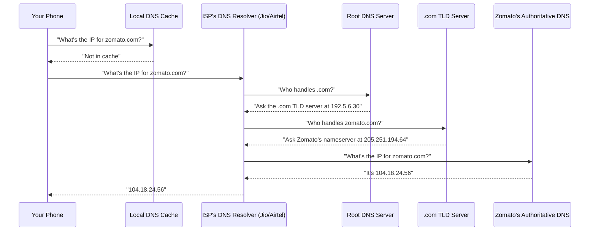
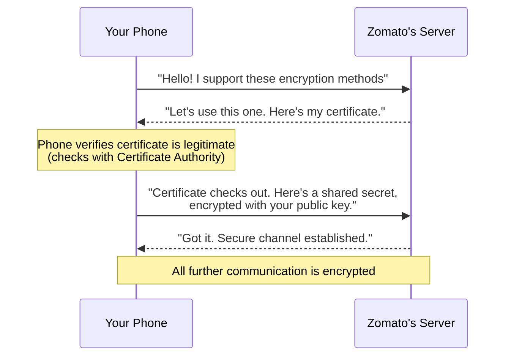
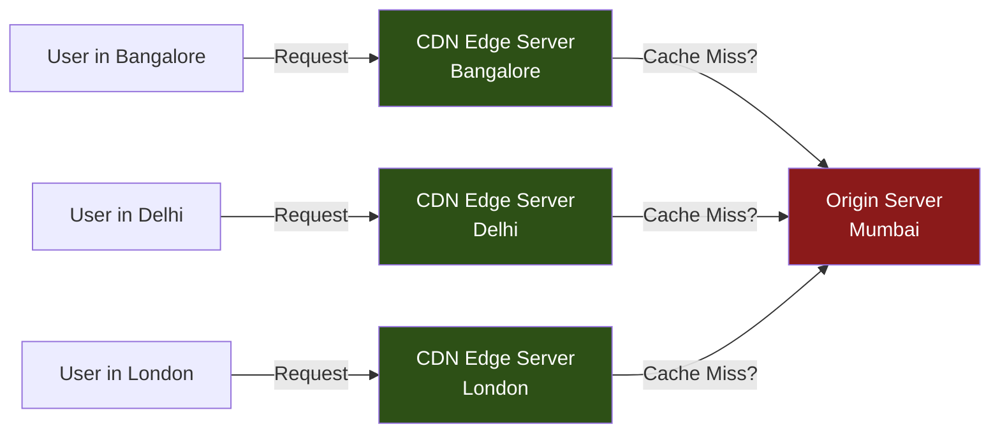
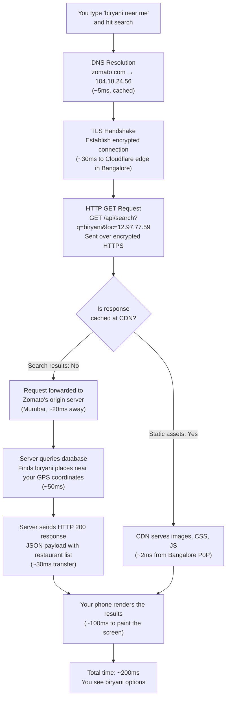

<span class="chapter-number">Chapter 1</span>

# The Internet — How Your Phone Talks to Zomato {.chapter-title}

You search for "biryani near me" on Zomato — what happens in the next 200 milliseconds?

Your thumb lifts off the glass. The letters you typed are still warm on the screen. And in the time it takes you to blink, your phone has already talked to at least six different computers spread across three countries, exchanged cryptographic secrets with a server you've never heard of, downloaded a list of restaurants sorted by distance, and begun loading thumbnail images of biryani from a machine that might be sitting in a data center twelve kilometers from your house.

All of this happened before you consciously registered the search results appearing.

This chapter is about that invisible machinery. Not at the level of electrical signals and binary — we'll get there later — but at the level that matters to someone building products: what are the moving pieces, where do things break, and why does any of it matter when you're deciding between putting your server in Mumbai or Virginia?

Let's start at the very beginning.

---

## Part 1: DNS — The Phonebook of the Internet

### The Problem of Names

When you type `zomato.com` into your browser, your phone faces an immediate problem. The internet doesn't run on names. It runs on numbers. Every machine connected to the internet has an address — a series of numbers called an **IP address** (Internet Protocol address — a unique numerical label assigned to every device on a network, like a postal address for computers). Zomato's servers might live at something like `104.18.24.56`. But nobody memorizes that, the same way nobody memorizes phone numbers anymore.

> **ANALOGY**: Think of DNS like the contacts app on your phone. You tap "Mom" and your phone translates that into +91-98XXX-XXXXX. You never think about the number. DNS does the same thing for the internet — it translates `zomato.com` into `104.18.24.56` so your phone knows where to send the request.

So how does your phone figure out the number behind the name?

### How DNS Resolution Actually Works

The system that translates human-readable names (like `zomato.com`) into machine-readable IP addresses is called **DNS** — the **Domain Name System**. It was designed in 1983 by Paul Mockapetris, but the vision of a globally connected information system was championed most visibly by Tim Berners-Lee when he invented the World Wide Web in 1989 at CERN. Berners-Lee built the web on top of the internet's existing infrastructure, and DNS was already there, quietly doing its job.

Here's what happens when you type `zomato.com`:



That's four hops. Four separate conversations between computers, each one happening in a few milliseconds. Let's break down each layer:

1. **Local DNS Cache**: Your phone first checks if it already knows the answer. If you visited Zomato ten minutes ago, the answer is stored locally. Cache hit = instant.

2. **ISP's Recursive Resolver**: If your phone doesn't know, it asks your internet provider's DNS server. If you're on Jio, this is a server Jio maintains — probably in the same city as you.

3. **Root DNS Servers**: There are only 13 sets of root DNS servers in the world (labeled A through M). They don't know where `zomato.com` lives, but they know who's in charge of all `.com` domains. Think of them as the reception desk of a massive office building — they don't know which desk Zomato sits at, but they know which floor to send you to.

4. **TLD (Top-Level Domain) Servers**: These handle everything ending in `.com`, `.in`, `.org`, etc. The `.com` TLD server knows that Zomato's DNS is managed by a specific nameserver.

5. **Authoritative DNS Server**: This is the final source of truth. It's the server that Zomato (or their DNS provider, often Cloudflare or AWS Route 53) has configured to say: "Yes, `zomato.com` maps to `104.18.24.56`."

> **REAL-LIFE**: In October 2021, Facebook went down for six hours. The root cause? A configuration change accidentally withdrew Facebook's DNS routes. Their authoritative DNS servers became unreachable. The name `facebook.com` had no IP address to point to. Every single person trying to visit Facebook, Instagram, or WhatsApp hit a wall — not because the servers were down, but because nobody could find them. DNS is the first domino. When it falls, everything falls.

> **INTUITION**: DNS resolution typically takes 20-120 milliseconds on the first lookup. But here's the key insight: because of caching at every layer (your phone, your router, your ISP), most DNS lookups in practice take under 5ms. The system was designed to be asked billions of times a day and almost always answer from memory, not from scratch.

### DNS and Product Decisions

Why should a product manager care about DNS? Because DNS configuration is where you decide:

- **Where your traffic goes**: DNS-level load balancing can route Indian users to Mumbai servers and US users to Virginia servers.
- **How fast your site recovers from outages**: A DNS TTL (Time to Live — how long a cached DNS answer is considered valid) of 300 seconds means if your server dies, users keep hitting the dead server for up to 5 minutes.
- **Whether your site works at all in certain countries**: Some countries filter DNS to block websites. If your product's DNS resolution is blocked, your product doesn't exist in that country.

---

## Part 2: HTTP Methods — The Language of the Web

Your phone now knows Zomato's IP address. But knowing an address isn't the same as having a conversation. Your phone needs a language to talk to Zomato's server — a set of rules for making requests and understanding responses.

That language is **HTTP** — **HyperText Transfer Protocol**. A protocol is an agreed-upon set of rules for communication, like how a formal letter has a greeting, body, and sign-off.

> **ANALOGY**: Imagine walking into a restaurant. HTTP is the language you use with the waiter. You don't walk into the kitchen and grab food yourself. You sit down, tell the waiter what you want, and the waiter brings it to you. The waiter is HTTP — the structured conversation between you (the client) and the kitchen (the server).

HTTP defines specific **methods** — types of requests you can make. There are four you need to know:

### GET — "Show me the menu"

A **GET** request asks for information without changing anything. When you open the Zomato app and it loads a list of restaurants, that's a GET request. You're saying: "Give me the list of biryani places near me."

```
GET /restaurants?query=biryani&location=bangalore HTTP/1.1
Host: api.zomato.com
```

GET requests are **idempotent** — a word that means you can make the same request 100 times and get the same result without changing anything on the server. Refreshing a page is safe because GET doesn't modify data.

### POST — "I'd like to place an order"

A **POST** request sends new data to the server to create something. When you place an order on Zomato, your app sends a POST request with your order details — the items, your address, payment info.

```
POST /orders HTTP/1.1
Host: api.zomato.com
Content-Type: application/json

{
  "restaurant_id": "18437812",
  "items": [{"name": "Hyderabadi Biryani", "qty": 1}],
  "address": "Koramangala, Bangalore"
}
```

POST is **not** idempotent. If you accidentally send the same POST twice, you might end up with two orders. This is why payment systems have to build extra safeguards — more on that in the APIs chapter.

### PUT — "Actually, change my order"

A **PUT** request updates an existing resource. You realize you want to change your delivery address? That's a PUT request — you're replacing the old address with a new one.

```
PUT /orders/98765/address HTTP/1.1
Host: api.zomato.com
Content-Type: application/json

{
  "address": "Indiranagar, Bangalore"
}
```

### DELETE — "Cancel the order"

A **DELETE** request removes something. You cancel the order before the restaurant starts preparing it.

```
DELETE /orders/98765 HTTP/1.1
Host: api.zomato.com
```

> **REAL-LIFE**: In 2017, a junior developer at a company ran a DELETE request against a production database without a WHERE clause — meaning "delete everything." The equivalent of telling the waiter "cancel every order this restaurant has ever received." The entire database was wiped. This is why production environments have safeguards: role-based access, confirmation steps, and backups. The HTTP method itself is neutral — it's the guardrails around it that matter.

> **INTUITION**: Here's a mental model that sticks. Map HTTP methods to CRUD operations — the four fundamental things you can do with data:
>
> | HTTP Method | CRUD Operation | Restaurant Analogy |
> |-------------|---------------|-------------------|
> | GET | **R**ead | "Show me the menu" |
> | POST | **C**reate | "Place a new order" |
> | PUT | **U**pdate | "Change my order" |
> | DELETE | **D**elete | "Cancel my order" |
>
> Every product feature you'll ever build maps to some combination of these four operations. A "like" button? POST to create a like. An "unlike"? DELETE to remove it. Editing your profile? PUT with the new data. Loading your feed? GET.

---

## Part 3: Status Codes — The Server's Vocabulary

When Zomato's server receives your request, it has to respond. And that response starts with a three-digit number called a **status code** — a standardized way for the server to tell your phone what happened.

There are dozens of status codes, but they fall into five families:

```
+-------+------------------------------------------+
| Range | Meaning                                  |
+-------+------------------------------------------+
| 1xx   | "Hold on, I'm working on it"             |
| 2xx   | "Here you go, everything worked"          |
| 3xx   | "What you want is somewhere else"         |
| 4xx   | "You made a mistake in your request"      |
| 5xx   | "I broke. It's my fault."                |
+-------+------------------------------------------+
```

### The Codes That Matter

**200 OK** — "Here's your biryani."
The request worked. The server found what you asked for and is sending it back. This is the response you want to see on every API call.

**201 Created** — "Your order has been placed."
The POST request succeeded and a new resource was created. You placed an order and it exists now.

**301 Moved Permanently** — "We've moved. Here's our new address."
The URL you requested has permanently changed. Your browser should go to the new URL instead. This is how companies handle domain migrations — when `www.zomato.com` redirects to `zomato.com`.

**400 Bad Request** — "I can't understand what you're asking for."
Your request was malformed. Maybe you sent an order without specifying any items. The server can't process it.

**401 Unauthorized** — "Who are you? Show me your ID."
You're trying to access something that requires authentication, but you haven't logged in or your token has expired.

**403 Forbidden** — "I know who you are, but you're not allowed in here."
You're authenticated, but you don't have permission. A regular Zomato user trying to access the restaurant owner's dashboard would get a 403.

**404 Not Found** — "We don't have that dish."
The resource you asked for doesn't exist. You typed a wrong URL, or the page was removed. This is the most famous status code on the internet — everyone has seen a 404 page.

**429 Too Many Requests** — "Slow down, you're ordering too fast."
Rate limiting. You've made too many requests in too short a time. APIs use this to prevent abuse.

**500 Internal Server Error** — "The kitchen is on fire."
Something went wrong on the server's side. It's not your fault — the server code crashed, or a database connection failed, or some dependency is down.

**503 Service Unavailable** — "We're closed for maintenance."
The server is temporarily unable to handle requests. Often used during deployments or when a server is overloaded.

> **ANALOGY**: Status codes are the waiter's facial expressions and words combined. A smile and a plate of food = 200. A confused look and "we don't serve that" = 404. The waiter running out of the kitchen with a fire extinguisher = 500. The bouncer at the door saying "members only" = 403.

> **REAL-LIFE**: Cloudflare, which sits in front of a significant portion of the internet (more on CDNs later), published data showing that across their network, roughly 52% of HTTP responses are 200 (success), about 3% are 404 (not found), and around 1% are 5xx (server errors). The remaining responses are a mix of redirects (3xx) and other client errors. That 1% of 5xx errors sounds small — until you realize Cloudflare handles over 57 million HTTP requests per second. That's 570,000 server errors every second across the internet.

> **INTUITION**: When you're building a product, the status code is your first clue when debugging. Train yourself to read them like a doctor reads vital signs. A spike in 500s means your server code is broken. A spike in 429s means someone is hammering your API (or your rate limits are too aggressive). A spike in 401s means your authentication flow is failing — maybe a token expiry bug after a deploy.

---

## Part 4: HTTPS — The Sealed Envelope

So far, we've talked about HTTP. But look at the URL bar in your browser right now — it probably says `https://`, not `http://`. That extra "S" stands for **Secure**, and it's the difference between a postcard and a sealed envelope.

### The Problem with Plain HTTP

When you send an HTTP request, the data travels through many intermediate machines — your router, your ISP's equipment, potentially other network infrastructure. With plain HTTP, every one of these intermediaries can read your data. Your search query, your password, your credit card number — all visible in plain text.

> **ANALOGY**: Sending data over HTTP is like writing your credit card number on a postcard and mailing it. Every postal worker who handles it can read it. HTTPS is like putting that postcard in a sealed, tamper-proof envelope. The postal workers still carry it, but they can't see what's inside.

### How HTTPS Works (The TLS Handshake)

HTTPS uses a protocol called **TLS** (Transport Layer Security — a cryptographic protocol that provides encrypted communication between two computers) to encrypt the conversation between your phone and the server. Before any actual data is exchanged, your phone and the server perform a **TLS handshake** — a rapid negotiation to establish a secure connection.



The certificate is issued by a **Certificate Authority (CA)** — a trusted third party (like Let's Encrypt, DigiCert, or Comodo) that vouches for the server's identity. When your browser shows a padlock icon, it means:

1. The server proved its identity with a valid certificate
2. The certificate was issued by a CA your browser trusts
3. All data between you and the server is encrypted

> **REAL-LIFE**: In 2011, a Dutch Certificate Authority called DigiNotar was compromised. Attackers issued fraudulent certificates for domains including `google.com`. This meant someone sitting between an Iranian user and Google could intercept and read all their Gmail traffic — even though the browser showed HTTPS. The attack affected an estimated 300,000 Iranian users. DigiNotar was removed from all browsers' trust lists and went bankrupt within months. The entire HTTPS system relies on trusting Certificate Authorities. When that trust breaks, everything breaks.

> **INTUITION**: The TLS handshake adds latency — typically 1-2 round trips between client and server before any data flows. On a connection with 50ms round-trip time, that's 100-150ms of overhead. This is why TLS 1.3 (released in 2018) reduced the handshake to a single round trip, and supports **0-RTT resumption** — if you've connected to this server before, you can start sending encrypted data immediately, with zero extra round trips. For a product manager, this translates directly to faster page loads for returning users.

### Why the Lock Icon Matters for Products

Google started using HTTPS as a ranking signal in 2014. By 2018, Chrome began marking all HTTP sites as "Not Secure" in the address bar. Today, over 95% of pages loaded in Chrome use HTTPS.

If your product doesn't use HTTPS:
- Browsers will warn users before they visit your site
- Google will rank you lower in search results
- Users' data is exposed to anyone on the same network (coffee shop Wi-Fi, anyone?)
- You can't use modern browser features like geolocation, camera access, or service workers — browsers require HTTPS for these APIs

---

## Part 5: Latency — Why Geography Still Matters

You've got DNS resolution, an HTTP request, and a TLS handshake. Each of these involves data traveling between your phone and a server. And here's the thing that surprises most people in the software world: **the speed of light is a real constraint**.

### The Speed of Light Problem

Light in a vacuum travels at approximately 300,000 km/second. In a fiber optic cable, it's slower — about 200,000 km/second (roughly two-thirds the speed of light, because light bounces around inside the fiber rather than traveling in a straight line).

The distance from Mumbai to Virginia (where many AWS data centers live) is approximately 13,500 km. At 200,000 km/s through fiber:

```
+-------------------------------------------------------------+
|  LATENCY CALCULATION: Mumbai to Virginia                     |
+-------------------------------------------------------------+
|                                                              |
|  Distance (fiber route, not straight line): ~16,000 km       |
|  Speed of light in fiber: ~200,000 km/s                      |
|  One-way travel time: 16,000 / 200,000 = 80ms               |
|  Round trip (request + response): ~160ms                     |
|                                                              |
|  Add network hops, routing, processing: ~40-60ms             |
|  Total realistic round-trip: 200-250ms                       |
|                                                              |
+-------------------------------------------------------------+
|                                                              |
|  LATENCY CALCULATION: Mumbai to Mumbai (same city)           |
+-------------------------------------------------------------+
|                                                              |
|  Distance: ~20 km                                            |
|  Round trip through fiber + processing: 2-10ms               |
|                                                              |
+-------------------------------------------------------------+
```

That's a 25x to 100x difference in latency depending on where your server sits. And remember — a single page load might require 20-50 separate requests (HTML, CSS, JavaScript, images, API calls, fonts). Even with parallel requests, the latency adds up.

> **ANALOGY**: Imagine you need to ask someone a question. If they're sitting across the table, you get an answer in 2 seconds. If they're in another city and you have to call them, it takes 30 seconds with dialing and pleasantries. Now imagine you need to ask 30 questions in a row. Across the table: 1 minute. By phone to another city: 15 minutes. That's the difference between a local server and a distant one when your page makes dozens of requests.

> **REAL-LIFE**: Amazon found that every 100ms of added latency cost them 1% in sales. Google found that an extra 500ms in search page load time reduced traffic by 20%. Walmart reported that for every 1 second of improvement in page load time, conversions increased by 2%. These numbers are from studies conducted between 2006-2012, and they've only become more relevant as user expectations have increased. When your competitor's app loads in 1.5 seconds and yours loads in 3 seconds, users don't think "the server is far away" — they think "this app is slow" and switch.

> **INTUITION**: Here's a framework for thinking about latency budgets. A typical mobile user expects a page to feel interactive within 2-3 seconds. Your budget looks like this:
>
> - DNS resolution: 0-50ms (usually cached)
> - TLS handshake: 50-150ms (depending on server distance)
> - Server processing: 50-200ms (your code running)
> - Data transfer: 50-500ms (depending on payload size and connection speed)
> - Client rendering: 100-500ms (browser parsing and painting)
>
> If your server is in Virginia and your user is in Bangalore, you've already spent 200ms on the round trip alone — before a single line of your application code runs. Put the server in Mumbai and you buy back 190ms. That's not optimization. That's architecture.

---

## Part 6: CDNs — The Chain of Neighborhood Stores

So the speed of light means distance matters. But you can't put a server in every city, can you? Actually, you can. That's what a **CDN** does.

**CDN** stands for **Content Delivery Network** — a geographically distributed network of servers that stores copies of your content closer to your users.

> **ANALOGY**: Think about how Amul distributes milk. They don't ship every packet from their factory in Anand, Gujarat to your door. They have a chain: factory to regional distributors to local stores. By the time you walk to your neighborhood store, the milk is already there waiting. A CDN is the internet's version of this distribution chain. Your content — images, videos, JavaScript files — is copied to servers in dozens or hundreds of cities worldwide. When a user in Bangalore requests an image, it comes from a server in Bangalore, not from your origin server in Mumbai or Virginia.

### How CDNs Work



1. The first user in Bangalore requests a Zomato restaurant image.
2. The CDN edge server (also called a **PoP** — Point of Presence) in Bangalore doesn't have it yet.
3. It fetches the image from Zomato's origin server in Mumbai (~20ms).
4. It stores (caches) a copy locally.
5. The next thousand users in Bangalore who request that same image get it from the Bangalore edge server in ~2ms.

### The Scale of CDNs

The numbers are staggering:

- **Cloudflare** operates in over 310 cities across 120+ countries and handles approximately 20% of all internet web traffic. They process over 57 million HTTP requests per second on average.
- **Akamai**, one of the oldest CDN providers, has over 365,000 servers in more than 135 countries. They deliver between 15-30% of all web traffic globally.
- **Amazon CloudFront** has 600+ edge locations across 100+ cities in 50+ countries.

When you use Zomato, Instagram, or Netflix, a significant portion of what loads on your screen — images, videos, CSS files, JavaScript bundles — never touches the company's own servers. It's served by CDN edge servers that might be in the same city as you, sometimes in the same building as your ISP.

> **REAL-LIFE**: During the 2023 Cricket World Cup, Disney+ Hotstar streamed matches to over 50 million concurrent viewers in India. That amount of traffic would crush any single data center. Hotstar uses a multi-CDN strategy — distributing load across Akamai, Cloudflare, and their own CDN infrastructure. The video content is cached at edge servers across India so that a viewer in Chennai is watching from a server in Chennai, and a viewer in Jaipur from a server in Jaipur. Without CDNs, live streaming to a country of 1.4 billion people would be physically impossible.

> **INTUITION**: Not everything belongs on a CDN. CDNs work best for **static content** — files that don't change per user (images, CSS, JavaScript, videos). **Dynamic content** — your personalized feed, your order status, your search results — typically still needs to hit the origin server because it's different for every user. However, modern CDN providers like Cloudflare are blurring this line with edge computing (Cloudflare Workers, for example), where you can run small pieces of application code at the edge server itself. This means even some dynamic content can be generated 2ms from the user instead of 200ms away.

### What a CDN Actually Caches

A common misconception: CDNs cache everything. They don't. What gets cached depends on **cache headers** — instructions your server sends that tell the CDN how to handle each piece of content:

```
+--------------------+------------------+---------------------------+
| Content Type       | Typically Cached | Cache Duration            |
+--------------------+------------------+---------------------------+
| Images (jpg, png)  | Yes              | Days to months            |
| CSS / JavaScript   | Yes              | Hours to weeks            |
| Video files        | Yes              | Days to months            |
| HTML pages         | Sometimes        | Seconds to minutes        |
| API responses      | Rarely           | Seconds (if at all)       |
| User-specific data | Never            | N/A — must hit origin     |
+--------------------+------------------+---------------------------+
```

---

## Part 7: India's Internet Infrastructure — The Submarine Cable Story

Everything we've talked about — DNS, HTTP, latency, CDNs — depends on physical infrastructure. Wires in the ground, cables under the ocean, data centers with racks of servers. And India's internet story is inseparable from one company's massive bet on infrastructure.

### Jio and the Submarine Cable Bet

When Reliance Jio launched in September 2016 with free 4G data, it triggered the largest and fastest digital migration in history. India went from approximately 300 million internet users to over 800 million in about six years. But Jio didn't start with the consumer launch — they started years earlier by investing in the physical backbone.

Jio is a part-owner of several submarine cable systems that carry internet traffic between India and the rest of the world:

- **AAE-1 (Asia-Africa-Europe-1)**: A 25,000 km cable connecting Hong Kong to France via India, with a capacity of over 40 terabits per second.
- **India-Asia-Xpress (IAX)**: A cable system connecting Mumbai to Singapore, specifically designed to reduce India's dependence on existing cable routes through the Suez Canal.
- **India-Europe-Xpress (IEX)**: Connecting Mumbai to Italy through the Middle East, providing a more direct route to European internet exchanges.

> **REAL-LIFE**: Before Jio's investments, India's international internet bandwidth was a bottleneck. Most traffic routed through a small number of submarine cable landing points — primarily Mumbai and Chennai. If a cable was damaged (which happens more often than you'd think — fishing trawlers and ship anchors are the leading causes), it could slow down internet for millions. In 2008, when three submarine cables in the Mediterranean were cut within days of each other, India experienced significant internet slowdowns. Jio's multi-route strategy is specifically designed to prevent this — if one cable goes down, traffic routes through alternatives.

### India's Data Center Boom

CDNs need physical locations to put their edge servers. This has driven a data center construction boom in India:

- **Mumbai** is India's primary internet hub, with the most submarine cable landing points and the highest density of data centers. Companies like Nxtra (Airtel), CtrlS, and Yotta operate large data centers here.
- **Chennai** is the second-largest hub, with several cable landing points connecting to Southeast Asia.
- **Hyderabad** and **Pune** are emerging as secondary data center markets.

Total data center capacity in India grew from approximately 499 MW in 2021 to a projected 1,700+ MW by 2026 — a tripling in five years, driven by cloud adoption, streaming video, and AI workloads.

> **INTUITION**: When you're choosing where to host your product's servers for Indian users, this infrastructure context matters. Mumbai gives you the lowest latency to the most users (it's the most connected city), but it's also the most expensive for data center space. Chennai is a strong secondary option, especially if your users are in South or Southeast India. The cloud providers (AWS, GCP, Azure) all have regions in Mumbai — AWS added a Hyderabad region in 2022, giving you another low-latency option for South Indian users.

### The Data Localization Factor

India's data protection regulations increasingly require certain categories of data to be stored within India. The Digital Personal Data Protection Act (2023) gives the government the power to restrict cross-border data transfers. For product builders, this has a practical implication: you may not have the choice to put your server in Virginia even if you wanted to. Your user data for Indian users may need to stay in India — which, from a latency perspective, is the right decision anyway.

---

## Part 8: Putting It All Together — The Full Journey of Your Biryani Search

Let's trace the complete path of your "biryani near me" search on Zomato, now that you understand each piece:



The entire round trip — from your thumb leaving the screen to restaurant listings appearing — happens in roughly 200 milliseconds. A fifth of a second. Four pieces of infrastructure (DNS, TLS, CDN, origin server) coordinated across multiple machines, using a protocol (HTTP) invented in 1991, secured by encryption that would take a supercomputer billions of years to crack, delivered through fiber optic cables running under the Arabian Sea.

And you didn't think about any of it. That's the point. The best infrastructure is invisible.

---

<div class="exercise">

## Exercise: Make a Raw HTTP Request with Claude Code

Now it's your turn. We're going to pull back the curtain and make a raw HTTP request — no browser, no app, direct conversation with a server.

**What you'll do**: Use `curl` (a command-line tool for making HTTP requests) to talk to a public API and see the raw HTTP response, including status codes and headers.

### Step 1: A basic GET request

Open your terminal (or ask Claude Code to run this) and type:

```bash
curl -v https://httpbin.org/get
```

The `-v` flag means "verbose" — show me everything, including the headers. You'll see:

- The DNS resolution
- The TLS handshake (cipher suite, certificate info)
- The HTTP request your machine sent
- The HTTP response headers (status code, content type)
- The response body (JSON data)

### Step 2: Make a POST request

```bash
curl -v -X POST https://httpbin.org/post \
  -H "Content-Type: application/json" \
  -d '{"order": "biryani", "quantity": 1}'
```

This sends a POST request with a JSON body. Look at the response — `httpbin.org` echoes back what you sent, so you can see exactly what the server received.

### Step 3: Trigger different status codes

```bash
# 200 OK
curl -s -o /dev/null -w "%{http_code}" https://httpbin.org/status/200

# 404 Not Found
curl -s -o /dev/null -w "%{http_code}" https://httpbin.org/status/404

# 500 Internal Server Error
curl -s -o /dev/null -w "%{http_code}" https://httpbin.org/status/500
```

The `-w "%{http_code}"` flag tells curl to print the status code. You're now speaking HTTP directly.

### Step 4: Measure latency

```bash
curl -s -o /dev/null -w "DNS: %{time_namelookup}s\nConnect: %{time_connect}s\nTLS: %{time_appconnect}s\nTotal: %{time_total}s\n" https://zomato.com
```

This breaks down where time is spent in the request. Compare the numbers with what we discussed in this chapter:
- `time_namelookup`: DNS resolution time
- `time_connect`: TCP connection time (network latency to server)
- `time_appconnect`: TLS handshake completion time
- `time_total`: Total request time

**Challenge**: Run the latency test against a few different sites — one hosted in India (like `zomato.com`), one in the US (like `github.com`), and one that uses a CDN (like `cloudflare.com`). Compare the numbers. You'll see the physics of the speed of light in your terminal.

</div>

---

## Key Takeaways

1. **DNS is the invisible first step** of every internet interaction. It translates names to numbers. When it breaks, nothing works — not even your error page.

2. **HTTP is a conversation with four verbs**: GET (read), POST (create), PUT (update), DELETE (remove). Every feature you build maps to some combination of these.

3. **Status codes are diagnostic tools**. Learn to read 200, 400, 401, 403, 404, 429, 500, and 503 instinctively. They're the vital signs of your application.

4. **HTTPS isn't optional** — it's the baseline. Without it, browsers punish you, search engines demote you, and your users' data is exposed.

5. **Latency is a physics problem**, not (only) a software problem. The speed of light means geography matters. A server in Mumbai versus Virginia can mean 200ms of difference — enough to measurably affect revenue.

6. **CDNs solve the geography problem for static content** by putting copies of your files in servers around the world. Cloudflare and Akamai together handle roughly half the web's traffic this way.

7. **India's internet infrastructure** is defined by submarine cables, data center build-outs, and regulatory requirements for data localization. Understanding this landscape helps you make better hosting and architecture decisions.

---

**Chapter endnotes**

1. Paul Mockapetris designed the Domain Name System in 1983, documented in RFC 882 and RFC 883, later updated by RFC 1034 and RFC 1035.

2. Tim Berners-Lee's original proposal for the World Wide Web was submitted at CERN in March 1989. The first website went live in December 1990.

3. The Facebook DNS outage of October 4, 2021, is documented in Facebook's engineering blog post "More details about the October 4 outage" (2021). The outage lasted approximately 6 hours and affected Facebook, Instagram, WhatsApp, and Messenger.

4. The DigiNotar certificate authority compromise was detailed in the Fox-IT report "DigiNotar Certificate Authority Breach" (2012). An estimated 300,000 Iranian Gmail users were affected.

5. Amazon's latency-to-revenue correlation (100ms = 1% sales loss) was reported by Greg Linden at Amazon in a 2006 presentation. Google's 500ms finding was published by Marissa Mayer at a 2006 Web 2.0 conference. Walmart's data was shared by Walmart Labs in their 2012 case study on web performance.

6. Cloudflare's network statistics: 310+ cities, 120+ countries, and approximately 20% of web traffic as reported in Cloudflare's 2024 annual report and radar data. The 57 million HTTP requests per second figure is from Cloudflare's Q4 2023 earnings report.

7. Akamai's infrastructure data: 365,000+ servers in 135+ countries, delivering 15-30% of web traffic as documented in Akamai's "Facts & Figures" page and investor reports (2024).

8. Disney+ Hotstar's Cricket World Cup 2023 streaming figures were reported in multiple Indian tech publications, with concurrent viewer counts exceeding 50 million during peak matches (India vs. Pakistan group stage).

9. Jio's submarine cable investments (AAE-1, IAX, IEX) are documented in Reliance Industries' annual reports and submarine cable industry databases (TeleGeography).

10. India's data center capacity growth projections (499 MW in 2021 to 1,700+ MW by 2026) are from JLL India's "Data Center Market Update" reports and ICRA industry analyses.

11. The 2008 Mediterranean submarine cable cuts affected FLAG Telecom, SEA-ME-WE 3, and SEA-ME-WE 4 cables. India experienced 50-60% reduction in internet bandwidth to Europe and the US.

12. TLS 1.3, published as RFC 8446 in August 2018, reduced the handshake from two round trips (TLS 1.2) to one, with 0-RTT resumption support.

13. Google's HTTPS ranking signal was announced in the Google Webmaster Central Blog post "HTTPS as a ranking signal" (August 2014). Chrome's "Not Secure" warnings for HTTP sites began in Chrome 68 (July 2018).

14. India's Digital Personal Data Protection Act was passed by Parliament on August 11, 2023, with provisions for restricting cross-border data transfers to certain notified countries.

15. `httpbin.org` is an open-source HTTP request and response service maintained by Kenneth Reitz, useful for testing and debugging HTTP clients.
